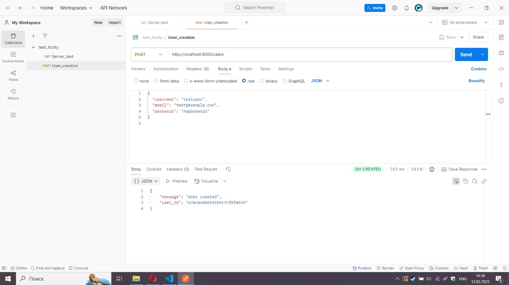
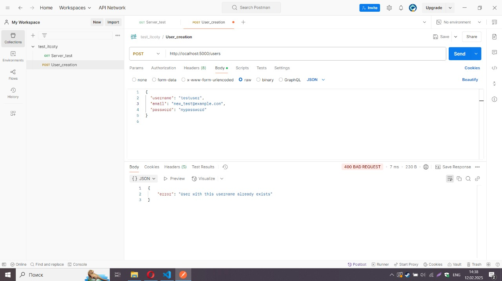

# Flask MongoDB User API

## Overview

This project is a simple API server built with Flask that allows you to create users and store their information in a MongoDB database. When registering a user, the input data is validated and the password is hashed for security. The project also ensures that both the email and username are unique.

## Features

- **Flask API:** Provides endpoints to check server status and create a user.
- **MongoDB:** Stores user data in a MongoDB database.
- **Security:** Passwords are hashed using `werkzeug.security`.
- **Validation:** Ensures that required fields are provided and that both the email and username are unique.

## Requirements

- **Python 3.6+**
- **MongoDB**

## Python Packages:
- flask
- pymongo
- werkzeug

## Installation
1. Clone the repository:

```bash
git clone
cd <PROJECT_DIRECTORY_NAME>
```

2. Create a virtual environment:

```bash
python -m venv venv
```

3. Activate the virtual environment:

Windows:
```bash
venv\Scripts\activate
```
macOS/Linux:
```bash
source venv/bin/activate
```

4. Install dependencies: If you have a requirements.txt file, run:

```bash
pip install -r requirements.txt
```
Otherwise, install the packages manually:

```bash
pip install flask pymongo werkzeug
```

5. Ensure MongoDB is running.

## Running the Server
To start the server, execute:

```bash
python app.py
```
The server will run in debug mode and be accessible at http://localhost:5000/.

## API Endpoints
1. Server Status Check
URL: /
Method: GET
Description: Returns the message "Server is running!" to verify that the server is up.
Example Request:
```bash 
curl http://localhost:5000/
```
2. Create a User
URL: /users
Method: POST
Description: Creates a new user by accepting a JSON payload with username, email, and password.
The password is hashed before storing, and both email and username are checked for uniqueness.
Example Request Body:
```json
{
  "username": "johndoe",
  "email": "john@example.com",
  "password": "securepassword"
}
```
Example Response (Success):
```json
{
  "message": "User created",
  "user_id": "60f5c8e2fdd2c3b6f8e4d9a1"
}
```
Possible Errors:
Missing required fields:
```json
{ "error": "Username, email and password are required" }
```

## Testing with Postman
1. Create a new collection in Postman, e.g., "Flask Mongo API".
2. Add requests:
- GET Request:
URL: http://localhost:5000/
- POST Request:
URL: http://localhost:5000/users
In the Body tab, select raw and JSON, then enter the sample user data.
3. Send the requests and verify the responses.

 This JSON [file](./test_itcoty.postman_collection.json) contains a set of predefined API requests
   